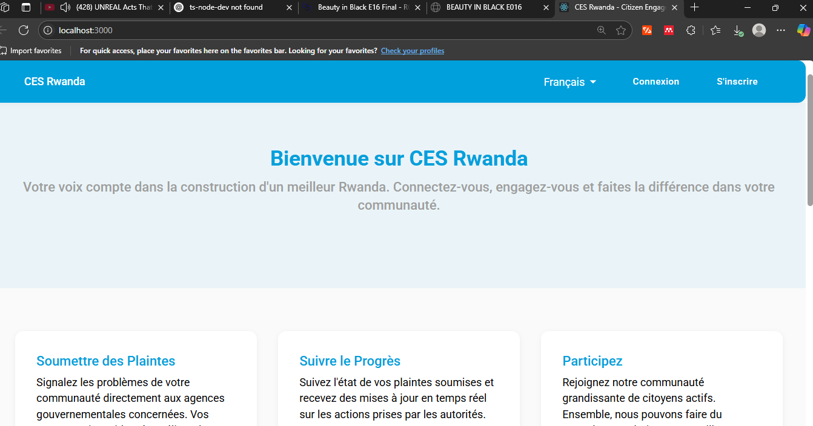
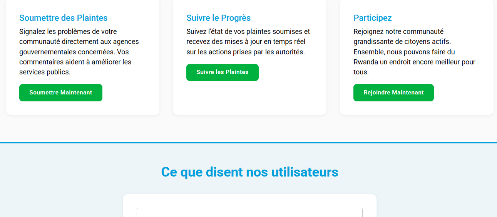
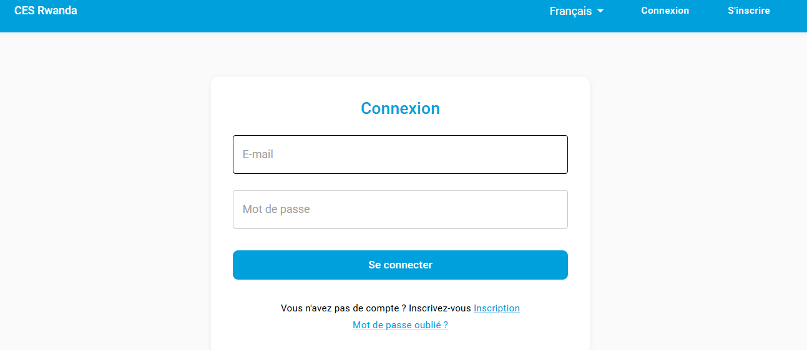
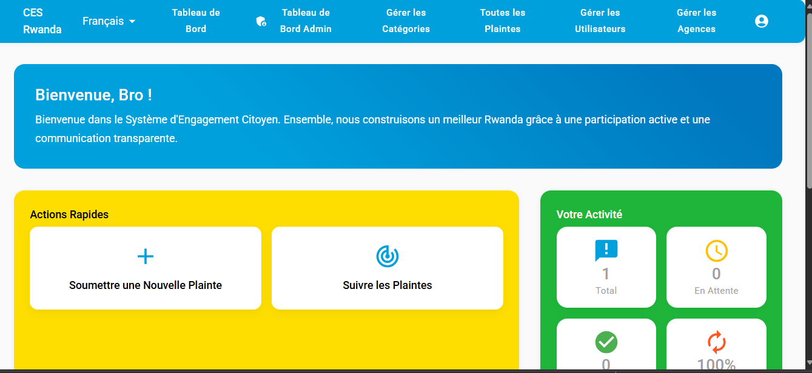
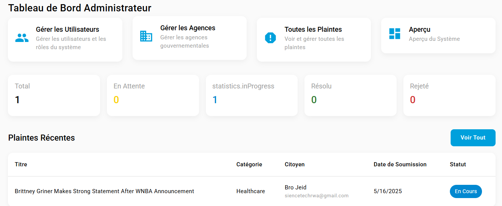

# 🇷🇼 Citizen Engagement System (CES) - Rwanda

> A modern and secure web application enabling Rwandan citizens to submit and track complaints/issues directed to government agencies.


---

## 🚀 Overview

The **Citizen Engagement System (CES)** bridges the gap between citizens and government institutions. It ensures issues are submitted through a centralized, trackable, and transparent platform—helping government agencies respond faster and more efficiently.

---
-----
### screenshots





 
-----
## 🎯 Problem Statement

Many complaints in Rwanda are currently submitted through fragmented and manual channels (e.g., in-person, SMS, unstructured emails), leading to:

- Delayed or no responses
- Lack of transparency in complaint handling
- Poor satisfaction and engagement

**CES solves this by:**

✅ Providing an intuitive portal for submitting and tracking complaints  
✅ Automatically routing complaints to relevant agencies  
✅ Enabling government institutions to respond efficiently

---

## ✅ Features

### 👤 User Features
- Email-based registration with verification
- Secure login and password reset
- Submit, update, and delete complaints
- Track complaint status in real time
- Attach supporting documents (images, PDFs)
- Categorize complaints (e.g., water, electricity, security)
- Location-based tagging of complaints

### 🏢 Agency Features
- Login to access agency dashboard
- View and manage assigned complaints
- Post responses and update complaint status
- Generate basic analytics (e.g., resolved vs pending)

### ⚙️ Admin Panel *(Optional MVP Feature)*
- Manage complaint categories
- View and assign complaints across agencies
- Oversee system usage metrics

---

## 🛠 Tech Stack

### 🧩 Frontend
- React 18 + TypeScript
- Vite for fast development
- Material-UI (MUI)
- Redux Toolkit for global state
- Formik + Yup for forms and validation
- Axios for API integration

### 🔧 Backend
- Node.js + Express.js (TypeScript)
- PostgreSQL (via Render)
- TypeORM for database ORM
- JWT for secure auth
- Nodemailer for email verification and password reset

---

## 📁 Project Structure

citizen-engagement-system/
├── frontend/
│ ├── src/
│ │ ├── components/ # Reusable UI components
│ │ ├── pages/ # Page-level components
│ │ ├── store/ # Redux store config
│ │ ├── theme/ # MUI theme overrides
│ │ └── App.tsx
│ ├── package.json
│ └── vite.config.ts
│
└── backend/
├── src/
│ ├── controllers/ # Route controllers
│ ├── entity/ # TypeORM entities
│ ├── middleware/ # Authentication, error handling
│ ├── routes/ # Express routes
│ ├── services/ # Business logic
│ └── index.ts
└── package.json


---

## 🌐 API Endpoints

### 🔐 Authentication
- `POST /api/auth/register` — Register new user
- `POST /api/auth/login` — Login
- `GET /api/auth/verify/:token` — Email verification
- `POST /api/auth/forgot-password` — Reset password

### 📝 Complaints
- `POST /api/complaints` — Submit complaint
- `GET /api/complaints` — List user complaints
- `GET /api/complaints/:id` — Complaint details
- `PUT /api/complaints/:id` — Update complaint
- `DELETE /api/complaints/:id` — Delete complaint

### 🗂 Categories
- `GET /api/categories` — List complaint categories
- `POST /api/categories` — Create new category (admin only)

### 🏛 Agencies
- `GET /api/agencies` — List agencies
- `GET /api/agencies/:id/complaints` — Agency-specific complaints

---

## 🖼 Screenshots

<!-- Replace below with actual image file paths inside a `screenshots/` folder -->
### 📌 Complaint Submission Page  


### 🗃️ User Dashboard  


### 🏢 Agency Dashboard  


---

## ⚙️ Getting Started

### ✅ Prerequisites
- Node.js v16+
- npm or yarn
- Git

### 📦 Installation

```bash
git clone https://github.com/jeid12/Citizen-Engagement-System.git
cd Citizen-Engagement-System

Frontend
```
cd frontend
npm install
npm run dev
```
Backend
```
cd ../backend
npm install
npm run dev
```

DATABASE_URL=yourpostgres_url
NODE_ENV=development
JWT_SECRET=your_jwt_secret

🙏 Acknowledgments
Rwanda ICT Chamber

Government of Rwanda

All contributors, mentors, and testers

Competition organizers and participants

📬 Contact
Author: Jean Damour Niyokwizera

📞 Phone: +250 784 422 138

📧 Email: niyokwizerajd123@gmail.com

🌐 GitHub: Citizen-Engagement-System

